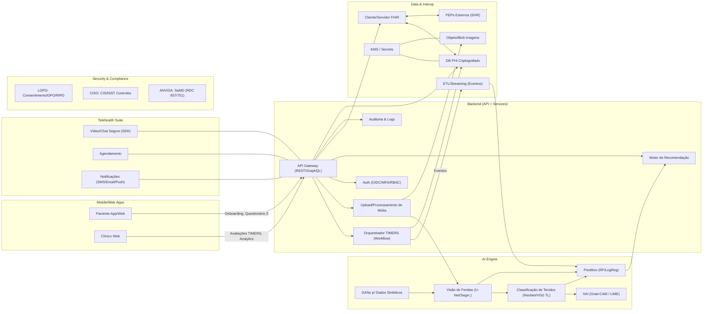

## Arquitetura do Heal+

Diagrama de alto nível:

```mermaid
flowchart LR
  subgraph "Mobile/Web Apps"
    PPortal["Paciente App/Web"]
    CPortal["Clínico Web"]
  end

  subgraph "Telehealth Suite"
    Vid["Vídeo/Chat Seguro (SDK)"]
    Sched["Agendamento"]
    Notif["Notificações (SMS/Email/Push)"]
  end

  subgraph "AI Engine"
    CV["Visão de Feridas (U-Net/Segm.)"]
    Tissue["Classificação de Tecidos (ResNet/VGG TL)"]
    Pred["Preditivo (RF/LogReg)"]
    XAI["XAI (Grad-CAM / LIME)"]
    GAN["GANs p/ Dados Sintéticos"]
  end

  subgraph "Backend (API + Services)"
    API["API Gateway (REST/GraphQL)"]
    TIMERS["Orquestrador TIMERS (Workflow)"]
    Media["Upload/Processamento de Mídia"]
    Reco["Motor de Recomendação"]
    Auth["Auth (OIDC/MFA/RBAC)"]
    Audit["Auditoria & Logs"]
  end

  subgraph "Data & Interop"
    DB["DB PHI Criptografado"]
    Obj["Objeto/Blob Imagens"]
    FHIR["Cliente/Servidor FHIR"]
    ETL["ETL/Streaming (Eventos)"]
    Keys["KMS / Secrets"]
    ExtPEP["PEPs Externos (EHR)"]
  end

  subgraph "Security & Compliance"
    DPO["LGPD: Consentimento/DPO/RIPD"]
    Sec["CISO: CIS/NIST Controles"]
    Anvisa["ANVISA: SaMD (RDC 657/751)"]
  end

  PPortal -->|Onboarding, Questionário S| API
  CPortal -->|Avaliações TIMERS, Analytics| API
  Vid --- API
  Sched --- API
  Notif --- API

  API --> TIMERS
  API --> Media
  API --> Auth
  API --> Reco
  API --> FHIR
  API --> Audit

  Media --> CV --> Tissue --> XAI
  Tissue --> Pred
  CV --> Pred
  Pred --> Reco
  GAN --> CV

  TIMERS -->|Eventos| ETL --> Pred
  TIMERS --> DB
  Media --> Obj
  API --> DB
  Keys --- DB
  Keys --- Obj

  FHIR <--> DB
  FHIR <--> ExtPEP
```

Componentes e responsabilidades estão detalhados no README e nas demais docs.

