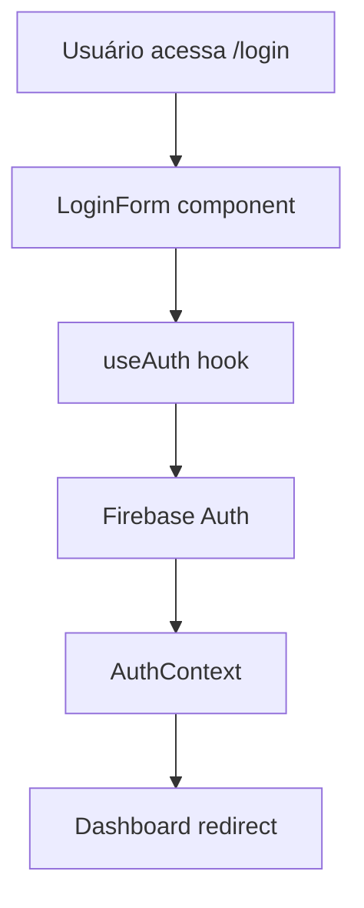
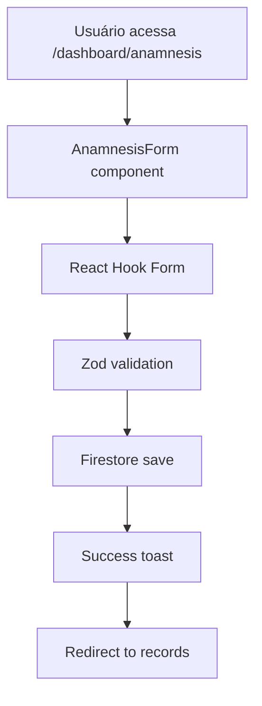
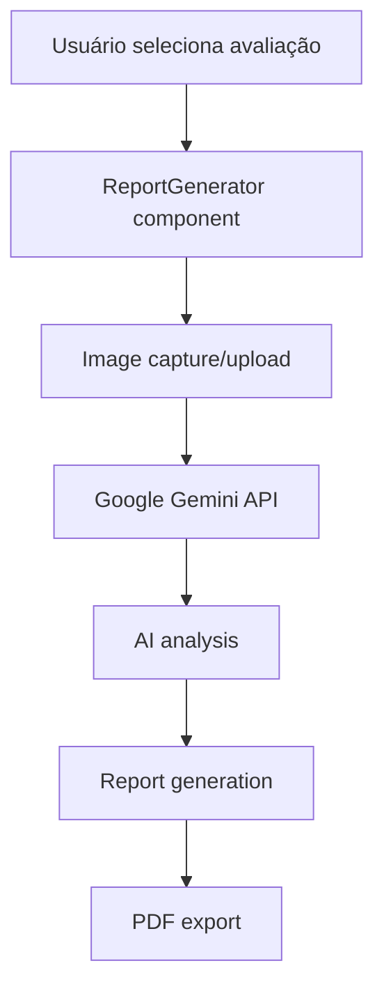

# 📚 Guia de Estudo do Código - Heal+

Este guia foi criado para facilitar o estudo e entendimento da arquitetura e estrutura do código do Heal+. Aqui você encontrará explicações detalhadas sobre como o sistema funciona internamente.

## 📋 Índice

- [Visão Geral da Arquitetura](#visão-geral-da-arquitetura)
- [Estrutura de Diretórios](#estrutura-de-diretórios)
- [Fluxo de Dados](#fluxo-de-dados)
- [Componentes Principais](#componentes-principais)
- [Hooks e Contextos](#hooks-e-contextos)
- [Integração com Firebase](#integração-com-firebase)
- [Sistema de IA](#sistema-de-ia)
- [Padrões de Código](#padrões-de-código)
- [Exemplos Práticos](#exemplos-práticos)

## 🏗️ Visão Geral da Arquitetura

### **Stack Tecnológica**

```
Frontend (Next.js 15)
├── React 18 + TypeScript
├── Tailwind CSS (styling)
├── Radix UI (componentes)
├── React Hook Form (formulários)
└── Zod (validação)

Backend (Firebase)
├── Firestore (banco de dados)
├── Authentication (usuários)
├── Storage (imagens)
└── Realtime Database (chat)

IA (Google Gemini)
├── Análise de imagens
├── Geração de relatórios
└── Chat inteligente
```

### **Padrão Arquitetural**

O Heal+ segue o padrão **Component-Based Architecture** com:

- **Separação de responsabilidades**
- **Reutilização de componentes**
- **Estado global gerenciado**
- **Tipagem estática com TypeScript**

## 📁 Estrutura de Diretórios

### **Estrutura Principal**

```
src/
├── app/                    # App Router (Next.js 15)
│   ├── dashboard/         # Páginas do dashboard
│   ├── login/            # Páginas de autenticação
│   ├── signup/           # Páginas de cadastro
│   ├── page.tsx          # Landing page
│   ├── layout.tsx        # Layout principal
│   └── globals.css       # Estilos globais
├── components/           # Componentes React
│   ├── dashboard/        # Componentes específicos
│   ├── ui/              # Componentes reutilizáveis
│   └── auth/            # Componentes de autenticação
├── lib/                 # Utilitários e configurações
├── hooks/               # Custom hooks
├── contexts/            # Context providers
├── firebase/            # Configuração Firebase
└── ai/                  # Fluxos de IA
```

### **Explicação Detalhada**

#### **`src/app/` - App Router**
```typescript
// Estrutura baseada em arquivos
app/
├── page.tsx              # Rota: /
├── login/page.tsx        # Rota: /login
├── signup/page.tsx       # Rota: /signup
├── dashboard/            # Rota: /dashboard/*
│   ├── page.tsx         # Rota: /dashboard
│   ├── anamnesis/       # Rota: /dashboard/anamnesis
│   ├── reports/         # Rota: /dashboard/reports
│   └── chat/            # Rota: /dashboard/chat
```

#### **`src/components/` - Componentes**
```typescript
components/
├── ui/                   # Componentes base (Button, Card, etc.)
├── dashboard/            # Componentes específicos do dashboard
│   ├── anamnesis-form.tsx
│   ├── report-generator.tsx
│   └── chat-system.tsx
└── auth/                 # Componentes de autenticação
    ├── login-form.tsx
    └── signup-form.tsx
```

## 🔄 Fluxo de Dados

### **Fluxo de Autenticação**



### **Fluxo de Criação de Anamnese**



### **Fluxo de Análise de IA**



## 🧩 Componentes Principais

### **1. AnamnesisForm**

```typescript
// src/components/dashboard/anamnesis-form.tsx
export function AnamnesisForm({ recordId, isEditMode }: AnamnesisFormProps) {
  // Estado do formulário
  const [formData, setFormData] = useState<AnamnesisData>();
  
  // Hook de autenticação
  const { user } = useAuth();
  
  // Configuração do formulário
  const form = useForm<AnamnesisData>({
    resolver: zodResolver(anamnesisSchema),
    defaultValues: defaultValues,
  });

  // Função de submit
  const onSubmit = async (data: AnamnesisData) => {
    try {
      if (isEditMode && recordId) {
        // Atualizar registro existente
        await updateDoc(doc(db, "users", user.uid, "anamnesis", recordId), data);
      } else {
        // Criar novo registro
        await addDoc(collection(db, "users", user.uid, "anamnesis"), data);
      }
    } catch (error) {
      console.error("Erro ao salvar:", error);
    }
  };

  return (
    <Form {...form}>
      <form onSubmit={form.handleSubmit(onSubmit)}>
        {/* Campos do formulário TIMERS */}
      </form>
    </Form>
  );
}
```

**Explicação:**
- **useForm**: Gerencia estado do formulário
- **zodResolver**: Valida dados com Zod
- **Firestore**: Salva dados no banco
- **TypeScript**: Tipagem estática

### **2. ReportGenerator**

```typescript
// src/components/dashboard/report-generator.tsx
export function ReportGenerator() {
  // Estado para avaliações
  const [anamnesisRecords, setAnamnesisRecords] = useState<AnamnesisRecord[]>([]);
  const [selectedAnamnesisId, setSelectedAnamnesisId] = useState<string>("");
  
  // Hook de autenticação
  const { user } = useAuth();
  
  // Função de geração de relatório
  const handleGenerateReport = async () => {
    try {
      // 1. Obter dados da anamnese
      const anamnesisData = await getAnamnesisData(selectedAnamnesisId);
      
      // 2. Enviar para análise de IA
      const analysis = await analyzeWoundImage(anamnesisData.woundImageUri);
      
      // 3. Gerar relatório
      const report = await generateReport(analysis, anamnesisData);
      
      // 4. Salvar no Firestore
      await saveReport(report);
      
      // 5. Exportar PDF
      await exportToPDF(report);
      
    } catch (error) {
      console.error("Erro ao gerar relatório:", error);
    }
  };

  return (
    <div className="space-y-6">
      {/* Seletor de avaliação */}
      <Select onValueChange={setSelectedAnamnesisId}>
        {/* Opções */}
      </Select>
      
      {/* Botão de geração */}
      <Button onClick={handleGenerateReport}>
        Gerar Relatório
      </Button>
    </div>
  );
}
```

**Explicação:**
- **Estado local**: Gerencia seleção de avaliação
- **Integração IA**: Chama Google Gemini
- **Firestore**: Salva relatórios
- **PDF**: Exporta relatórios

### **3. ChatSystem**

```typescript
// src/components/dashboard/chat-system.tsx
export function ChatSystem() {
  // Estado do chat
  const [messages, setMessages] = useState<ChatMessage[]>([]);
  const [inputMessage, setInputMessage] = useState("");
  const [isLoading, setIsLoading] = useState(false);
  
  // Função de envio de mensagem
  const handleSendMessage = async () => {
    if (!inputMessage.trim()) return;
    
    setIsLoading(true);
    
    try {
      // 1. Adicionar mensagem do usuário
      const userMessage: ChatMessage = {
        id: generateId(),
        text: inputMessage,
        sender: "user",
        timestamp: new Date(),
      };
      
      setMessages(prev => [...prev, userMessage]);
      
      // 2. Enviar para IA
      const aiResponse = await sendToAI(inputMessage);
      
      // 3. Adicionar resposta da IA
      const aiMessage: ChatMessage = {
        id: generateId(),
        text: aiResponse,
        sender: "ai",
        timestamp: new Date(),
      };
      
      setMessages(prev => [...prev, aiMessage]);
      
    } catch (error) {
      console.error("Erro no chat:", error);
    } finally {
      setIsLoading(false);
    }
  };

  return (
    <div className="flex flex-col h-full">
      {/* Lista de mensagens */}
      <div className="flex-1 overflow-y-auto">
        {messages.map(message => (
          <ChatMessage key={message.id} message={message} />
        ))}
      </div>
      
      {/* Input de mensagem */}
      <div className="border-t p-4">
        <div className="flex gap-2">
          <Input
            value={inputMessage}
            onChange={(e) => setInputMessage(e.target.value)}
            placeholder="Digite sua mensagem..."
          />
          <Button onClick={handleSendMessage} disabled={isLoading}>
            Enviar
          </Button>
        </div>
      </div>
    </div>
  );
}
```

**Explicação:**
- **Estado do chat**: Gerencia mensagens
- **Integração IA**: Envia mensagens para Gemini
- **UI responsiva**: Interface de chat moderna

## 🎣 Hooks e Contextos

### **1. useAuth Hook**

```typescript
// src/hooks/use-auth.tsx
export function useAuth() {
  const [user, setUser] = useState<User | null>(null);
  const [loading, setLoading] = useState(true);

  useEffect(() => {
    const unsubscribe = onAuthStateChanged(auth, (user) => {
      setUser(user);
      setLoading(false);
    });

    return unsubscribe;
  }, []);

  const login = async (email: string, password: string) => {
    try {
      await signInWithEmailAndPassword(auth, email, password);
    } catch (error) {
      throw error;
    }
  };

  const logout = async () => {
    try {
      await signOut(auth);
    } catch (error) {
      throw error;
    }
  };

  return {
    user,
    loading,
    login,
    logout,
  };
}
```

**Explicação:**
- **onAuthStateChanged**: Escuta mudanças de autenticação
- **Estado global**: Gerencia usuário logado
- **Métodos**: Login e logout

### **2. AuthContext**

```typescript
// src/contexts/auth-context.tsx
interface AuthContextType {
  user: User | null;
  loading: boolean;
  login: (email: string, password: string) => Promise<void>;
  logout: () => Promise<void>;
  loginWithGoogle: () => Promise<void>;
  loginWithMicrosoft: () => Promise<void>;
  loginWithApple: () => Promise<void>;
}

export const AuthContext = createContext<AuthContextType | undefined>(undefined);

export function AuthProvider({ children }: { children: React.ReactNode }) {
  const [user, setUser] = useState<User | null>(null);
  const [loading, setLoading] = useState(true);

  // Implementação dos métodos de login
  const loginWithGoogle = async () => {
    const provider = new GoogleAuthProvider();
    await signInWithPopup(auth, provider);
  };

  const loginWithMicrosoft = async () => {
    const provider = new OAuthProvider('microsoft.com');
    await signInWithPopup(auth, provider);
  };

  const loginWithApple = async () => {
    const provider = new OAuthProvider('apple.com');
    await signInWithPopup(auth, provider);
  };

  return (
    <AuthContext.Provider value={{
      user,
      loading,
      login,
      logout,
      loginWithGoogle,
      loginWithMicrosoft,
      loginWithApple,
    }}>
      {children}
    </AuthContext.Provider>
  );
}
```

**Explicação:**
- **Context API**: Estado global de autenticação
- **Múltiplos provedores**: Google, Microsoft, Apple
- **Provider**: Envolve a aplicação

## 🔥 Integração com Firebase

### **1. Configuração**

```typescript
// src/firebase/client-app.ts
import { initializeApp } from 'firebase/app';
import { getFirestore } from 'firebase/firestore';
import { getAuth } from 'firebase/auth';
import { getDatabase } from 'firebase/database';

const firebaseConfig = {
  apiKey: process.env.NEXT_PUBLIC_FIREBASE_API_KEY,
  authDomain: process.env.NEXT_PUBLIC_FIREBASE_AUTH_DOMAIN,
  projectId: process.env.NEXT_PUBLIC_FIREBASE_PROJECT_ID,
  storageBucket: process.env.NEXT_PUBLIC_FIREBASE_STORAGE_BUCKET,
  messagingSenderId: process.env.NEXT_PUBLIC_FIREBASE_MESSAGING_SENDER_ID,
  appId: process.env.NEXT_PUBLIC_FIREBASE_APP_ID,
  databaseURL: process.env.NEXT_PUBLIC_FIREBASE_DATABASE_URL,
};

export const app = initializeApp(firebaseConfig);
export const db = getFirestore(app);
export const auth = getAuth(app);
export const database = getDatabase(app);
```

### **2. Operações com Firestore**

```typescript
// Exemplo: Salvar anamnese
export async function saveAnamnesis(userId: string, data: AnamnesisData) {
  try {
    const docRef = await addDoc(collection(db, "users", userId, "anamnesis"), {
      ...data,
      createdAt: serverTimestamp(),
      updatedAt: serverTimestamp(),
    });
    return docRef.id;
  } catch (error) {
    console.error("Erro ao salvar anamnese:", error);
    throw error;
  }
}

// Exemplo: Buscar anamneses
export async function getAnamneses(userId: string): Promise<AnamnesisRecord[]> {
  try {
    const querySnapshot = await getDocs(
      collection(db, "users", userId, "anamnesis")
    );
    
    return querySnapshot.docs.map(doc => ({
      id: doc.id,
      ...doc.data(),
    })) as AnamnesisRecord[];
  } catch (error) {
    console.error("Erro ao buscar anamneses:", error);
    throw error;
  }
}
```

### **3. Regras de Segurança**

```javascript
// firestore.rules
rules_version = '2';

service cloud.firestore {
  match /databases/{database}/documents {
    // Usuários podem ler/escrever seus próprios documentos
    match /users/{userId} {
      allow read, write: if request.auth != null && request.auth.uid == userId;
      allow list: if request.auth != null;
    }

    // Subcoleções dentro de users
    match /users/{userId}/{collection}/{docId} {
      allow read, write: if request.auth != null && request.auth.uid == userId;
      allow list: if request.auth != null;
    }
  }
}
```

## 🤖 Sistema de IA

### **1. Configuração do Gemini**

```typescript
// src/ai/genkit.ts
import { GoogleGenerativeAI } from '@google/generative-ai';

const genAI = new GoogleGenerativeAI(process.env.GEMINI_API_KEY!);

export async function analyzeWoundImage(imageData: string): Promise<WoundAnalysis> {
  const model = genAI.getGenerativeModel({ model: 'gemini-pro-vision' });
  
  const prompt = `
    Analise esta imagem de ferida e forneça:
    1. Tipo de tecido predominante
    2. Sinais de infecção
    3. Nível de cicatrização
    4. Recomendações de tratamento
  `;

  const result = await model.generateContent([prompt, imageData]);
  const response = await result.response;
  const text = response.text();
  
  return parseAnalysisResponse(text);
}
```

### **2. Fluxo de Análise**

```typescript
// src/ai/flows/analyze-wound.ts
export async function analyzeWoundFlow(imageData: string, anamnesisData: AnamnesisData) {
  try {
    // 1. Análise da imagem
    const imageAnalysis = await analyzeWoundImage(imageData);
    
    // 2. Análise dos dados TIMERS
    const timersAnalysis = await analyzeTimersData(anamnesisData);
    
    // 3. Geração de relatório
    const report = await generateReport(imageAnalysis, timersAnalysis);
    
    // 4. Recomendações
    const recommendations = await generateRecommendations(report);
    
    return {
      imageAnalysis,
      timersAnalysis,
      report,
      recommendations,
    };
  } catch (error) {
    console.error("Erro no fluxo de análise:", error);
    throw error;
  }
}
```

## 📝 Padrões de Código

### **1. Naming Conventions**

```typescript
// ✅ Bom: Nomes descritivos
const userAnamnesisData = getAnamnesisData();
const isWoundInfected = checkInfection(woundData);
const woundMeasurements = calculateMeasurements(imageData);

// ❌ Ruim: Nomes genéricos
const data = getData();
const flag = checkFlag();
const measurements = calculate();
```

### **2. Estrutura de Componentes**

```typescript
// ✅ Bom: Estrutura organizada
export function Component({ prop1, prop2 }: ComponentProps) {
  // 1. Hooks
  const [state, setState] = useState();
  const { user } = useAuth();
  
  // 2. Event handlers
  const handleClick = () => {
    // lógica
  };
  
  // 3. Effects
  useEffect(() => {
    // lógica
  }, []);
  
  // 4. Render
  return (
    <div>
      {/* JSX */}
    </div>
  );
}
```

### **3. Tratamento de Erros**

```typescript
// ✅ Bom: Tratamento de erros
export async function saveData(data: any) {
  try {
    const result = await firestoreOperation(data);
    return result;
  } catch (error) {
    console.error("Erro ao salvar dados:", error);
    throw new Error("Falha ao salvar dados");
  }
}

// ❌ Ruim: Sem tratamento de erros
export async function saveData(data: any) {
  const result = await firestoreOperation(data);
  return result;
}
```

## 💡 Exemplos Práticos

### **1. Criando um Novo Componente**

```typescript
// src/components/ui/custom-button.tsx
import React from 'react';
import { cn } from '@/lib/utils';

interface CustomButtonProps {
  children: React.ReactNode;
  variant?: 'primary' | 'secondary' | 'danger';
  size?: 'sm' | 'md' | 'lg';
  disabled?: boolean;
  onClick?: () => void;
  className?: string;
}

export function CustomButton({ 
  children, 
  variant = 'primary',
  size = 'md',
  disabled = false,
  onClick,
  className 
}: CustomButtonProps) {
  const baseClasses = 'inline-flex items-center justify-center rounded-md font-medium transition-colors';
  
  const variantClasses = {
    primary: 'bg-primary text-primary-foreground hover:bg-primary/90',
    secondary: 'bg-secondary text-secondary-foreground hover:bg-secondary/80',
    danger: 'bg-destructive text-destructive-foreground hover:bg-destructive/90',
  };
  
  const sizeClasses = {
    sm: 'h-9 px-3 text-sm',
    md: 'h-10 px-4 py-2',
    lg: 'h-11 px-8 text-lg',
  };

  return (
    <button
      className={cn(
        baseClasses,
        variantClasses[variant],
        sizeClasses[size],
        disabled && 'opacity-50 cursor-not-allowed',
        className
      )}
      disabled={disabled}
      onClick={onClick}
    >
      {children}
    </button>
  );
}
```

### **2. Criando um Custom Hook**

```typescript
// src/hooks/use-anamnesis.ts
import { useState, useEffect } from 'react';
import { AnamnesisRecord } from '@/types/anamnesis';
import { getAnamneses, saveAnamnesis } from '@/lib/firestore';

export function useAnamnesis(userId?: string) {
  const [anamneses, setAnamneses] = useState<AnamnesisRecord[]>([]);
  const [loading, setLoading] = useState(false);
  const [error, setError] = useState<string | null>(null);

  const fetchAnamneses = async () => {
    if (!userId) return;
    
    setLoading(true);
    setError(null);
    
    try {
      const data = await getAnamneses(userId);
      setAnamneses(data);
    } catch (err) {
      setError(err instanceof Error ? err.message : 'Erro desconhecido');
    } finally {
      setLoading(false);
    }
  };

  const createAnamnesis = async (data: any) => {
    if (!userId) return;
    
    try {
      const id = await saveAnamnesis(userId, data);
      await fetchAnamneses(); // Recarregar lista
      return id;
    } catch (err) {
      setError(err instanceof Error ? err.message : 'Erro ao salvar');
      throw err;
    }
  };

  useEffect(() => {
    fetchAnamneses();
  }, [userId]);

  return {
    anamneses,
    loading,
    error,
    createAnamnesis,
    refetch: fetchAnamneses,
  };
}
```

### **3. Integrando com Firebase**

```typescript
// src/lib/firestore-operations.ts
import { 
  collection, 
  doc, 
  addDoc, 
  updateDoc, 
  deleteDoc, 
  getDocs, 
  getDoc,
  query,
  where,
  orderBy,
  serverTimestamp 
} from 'firebase/firestore';
import { db } from '@/firebase/client-app';

export class FirestoreService {
  // Criar documento
  static async create(collectionPath: string, data: any) {
    try {
      const docRef = await addDoc(collection(db, collectionPath), {
        ...data,
        createdAt: serverTimestamp(),
        updatedAt: serverTimestamp(),
      });
      return docRef.id;
    } catch (error) {
      console.error('Erro ao criar documento:', error);
      throw error;
    }
  }

  // Atualizar documento
  static async update(collectionPath: string, docId: string, data: any) {
    try {
      const docRef = doc(db, collectionPath, docId);
      await updateDoc(docRef, {
        ...data,
        updatedAt: serverTimestamp(),
      });
    } catch (error) {
      console.error('Erro ao atualizar documento:', error);
      throw error;
    }
  }

  // Buscar documentos
  static async get(collectionPath: string, filters?: any[]) {
    try {
      let q = collection(db, collectionPath);
      
      if (filters) {
        filters.forEach(filter => {
          q = query(q, where(filter.field, filter.operator, filter.value));
        });
      }
      
      const querySnapshot = await getDocs(q);
      return querySnapshot.docs.map(doc => ({
        id: doc.id,
        ...doc.data(),
      }));
    } catch (error) {
      console.error('Erro ao buscar documentos:', error);
      throw error;
    }
  }

  // Buscar documento específico
  static async getById(collectionPath: string, docId: string) {
    try {
      const docRef = doc(db, collectionPath, docId);
      const docSnap = await getDoc(docRef);
      
      if (docSnap.exists()) {
        return {
          id: docSnap.id,
          ...docSnap.data(),
        };
      }
      
      return null;
    } catch (error) {
      console.error('Erro ao buscar documento:', error);
      throw error;
    }
  }

  // Deletar documento
  static async delete(collectionPath: string, docId: string) {
    try {
      const docRef = doc(db, collectionPath, docId);
      await deleteDoc(docRef);
    } catch (error) {
      console.error('Erro ao deletar documento:', error);
      throw error;
    }
  }
}
```

## 🎯 Dicas para Estudo

### **1. Comece pelo Básico**
- **README.md**: Entenda o projeto
- **package.json**: Veja as dependências
- **tsconfig.json**: Configuração do TypeScript

### **2. Explore a Estrutura**
- **src/app/**: Páginas e rotas
- **src/components/**: Componentes reutilizáveis
- **src/lib/**: Utilitários e configurações

### **3. Entenda os Fluxos**
- **Autenticação**: Como funciona o login
- **Formulários**: Como são validados
- **Firebase**: Como os dados são salvos
- **IA**: Como funciona a análise

### **4. Pratique**
- **Crie componentes**: Experimente criar novos componentes
- **Modifique funcionalidades**: Adicione novas features
- **Debug**: Resolva problemas existentes

### **5. Use as Ferramentas**
- **DevTools**: Inspecione componentes
- **Console**: Veja logs e erros
- **Network**: Monitore requisições
- **Firebase Console**: Veja dados salvos

---

**📚 Este guia te ajudará a entender profundamente o código do Heal+. Use-o como referência durante seu estudo!**
