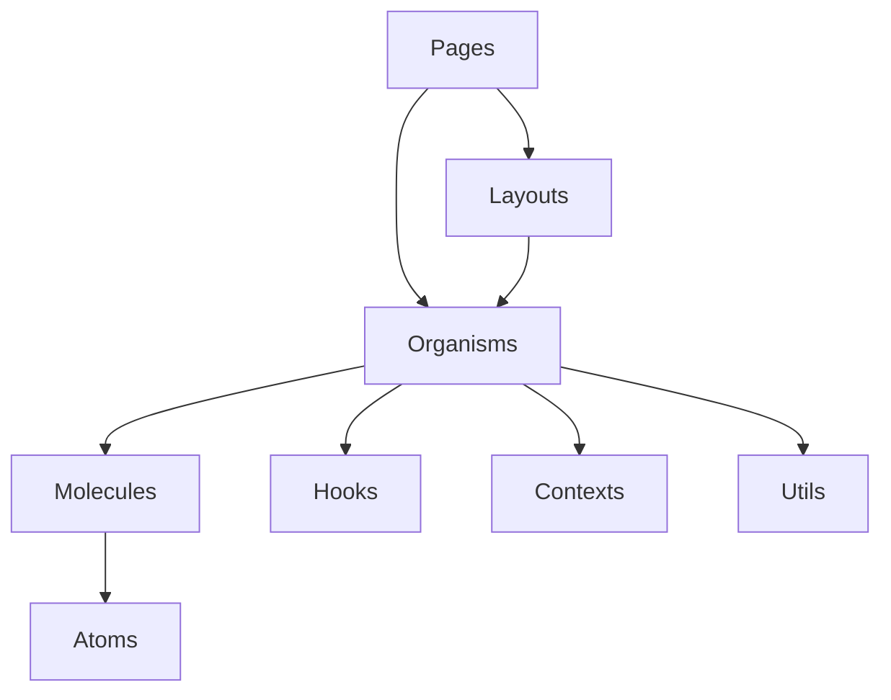

# 🧩 Arquitetura de Componentes - Heal+

Este guia explica como os componentes do Heal+ são organizados, suas responsabilidades e como eles se relacionam entre si.

## 📋 Índice

- [Visão Geral](#visão-geral)
- [Hierarquia de Componentes](#hierarquia-de-componentes)
- [Componentes Base (UI)](#componentes-base-ui)
- [Componentes de Negócio](#componentes-de-negócio)
- [Padrões de Composição](#padrões-de-composição)
- [Estado e Props](#estado-e-props)
- [Exemplos Práticos](#exemplos-práticos)

## 🏗️ Visão Geral

### **Filosofia de Design**

O Heal+ segue o padrão **Atomic Design** com algumas adaptações:

```
Atoms (Elementos básicos)
├── Button, Input, Label
├── Icons, Badges
└── Typography

Molecules (Combinações simples)
├── FormField, SearchBox
├── NavigationItem
└── StatusIndicator

Organisms (Componentes complexos)
├── Header, Sidebar
├── AnamnesisForm
└── ReportGenerator

Templates (Layouts)
├── DashboardLayout
├── AuthLayout
└── LandingLayout

Pages (Páginas completas)
├── Dashboard, Login
├── Anamnesis, Reports
└── Chat, Profile
```

## 🌳 Hierarquia de Componentes

### **Estrutura de Diretórios**

```
src/components/
├── ui/                    # Componentes base (Atoms + Molecules)
│   ├── button.tsx
│   ├── input.tsx
│   ├── card.tsx
│   ├── form.tsx
│   └── ...
├── dashboard/             # Componentes específicos (Organisms)
│   ├── anamnesis-form.tsx
│   ├── report-generator.tsx
│   ├── chat-system.tsx
│   └── ...
├── auth/                  # Componentes de autenticação
│   ├── login-form.tsx
│   ├── signup-form.tsx
│   └── ...
└── logo.tsx              # Componentes globais
```

### **Fluxo de Dependências**



## 🎨 Componentes Base (UI)

### **1. Button Component**

```typescript
// src/components/ui/button.tsx
import * as React from "react"
import { Slot } from "@radix-ui/react-slot"
import { cva, type VariantProps } from "class-variance-authority"
import { cn } from "@/lib/utils"

const buttonVariants = cva(
  "inline-flex items-center justify-center whitespace-nowrap rounded-md text-sm font-medium ring-offset-background transition-colors focus-visible:outline-none focus-visible:ring-2 focus-visible:ring-ring focus-visible:ring-offset-2 disabled:pointer-events-none disabled:opacity-50",
  {
    variants: {
      variant: {
        default: "bg-primary text-primary-foreground hover:bg-primary/90",
        destructive: "bg-destructive text-destructive-foreground hover:bg-destructive/90",
        outline: "border border-input bg-background hover:bg-accent hover:text-accent-foreground",
        secondary: "bg-secondary text-secondary-foreground hover:bg-secondary/80",
        ghost: "hover:bg-accent hover:text-accent-foreground",
        link: "text-primary underline-offset-4 hover:underline",
      },
      size: {
        default: "h-10 px-4 py-2",
        sm: "h-9 rounded-md px-3",
        lg: "h-11 rounded-md px-8",
        icon: "h-10 w-10",
      },
    },
    defaultVariants: {
      variant: "default",
      size: "default",
    },
  }
)

export interface ButtonProps
  extends React.ButtonHTMLAttributes<HTMLButtonElement>,
    VariantProps<typeof buttonVariants> {
  asChild?: boolean
}

const Button = React.forwardRef<HTMLButtonElement, ButtonProps>(
  ({ className, variant, size, asChild = false, ...props }, ref) => {
    const Comp = asChild ? Slot : "button"
    return (
      <Comp
        className={cn(buttonVariants({ variant, size, className }))}
        ref={ref}
        {...props}
      />
    )
  }
)
Button.displayName = "Button"

export { Button, buttonVariants }
```

**Características:**
- **Variantes**: Diferentes estilos visuais
- **Tamanhos**: Responsivo e consistente
- **Acessibilidade**: Focus e estados disabled
- **Composição**: Pode ser usado como Slot

### **2. Card Component**

```typescript
// src/components/ui/card.tsx
import * as React from "react"
import { cn } from "@/lib/utils"

const Card = React.forwardRef<
  HTMLDivElement,
  React.HTMLAttributes<HTMLDivElement>
>(({ className, ...props }, ref) => (
  <div
    ref={ref}
    className={cn(
      "rounded-lg border bg-card text-card-foreground shadow-sm",
      className
    )}
    {...props}
  />
))
Card.displayName = "Card"

const CardHeader = React.forwardRef<
  HTMLDivElement,
  React.HTMLAttributes<HTMLDivElement>
>(({ className, ...props }, ref) => (
  <div
    ref={ref}
    className={cn("flex flex-col space-y-1.5 p-6", className)}
    {...props}
  />
))
CardHeader.displayName = "CardHeader"

const CardTitle = React.forwardRef<
  HTMLParagraphElement,
  React.HTMLAttributes<HTMLHeadingElement>
>(({ className, ...props }, ref) => (
  <h3
    ref={ref}
    className={cn(
      "text-2xl font-semibold leading-none tracking-tight",
      className
    )}
    {...props}
  />
))
CardTitle.displayName = "CardTitle"

const CardDescription = React.forwardRef<
  HTMLParagraphElement,
  React.HTMLAttributes<HTMLParagraphElement>
>(({ className, ...props }, ref) => (
  <p
    ref={ref}
    className={cn("text-sm text-muted-foreground", className)}
    {...props}
  />
))
CardDescription.displayName = "CardDescription"

const CardContent = React.forwardRef<
  HTMLDivElement,
  React.HTMLAttributes<HTMLDivElement>
>(({ className, ...props }, ref) => (
  <div ref={ref} className={cn("p-6 pt-0", className)} {...props} />
))
CardContent.displayName = "CardContent"

const CardFooter = React.forwardRef<
  HTMLDivElement,
  React.HTMLAttributes<HTMLDivElement>
>(({ className, ...props }, ref) => (
  <div
    ref={ref}
    className={cn("flex items-center p-6 pt-0", className)}
    {...props}
  />
))
CardFooter.displayName = "CardFooter"

export { Card, CardHeader, CardFooter, CardTitle, CardDescription, CardContent }
```

**Características:**
- **Composição**: Múltiplos sub-componentes
- **Flexibilidade**: Pode ser usado de várias formas
- **Consistência**: Design system unificado

### **3. Form Components**

```typescript
// src/components/ui/form.tsx
import * as React from "react"
import * as LabelPrimitive from "@radix-ui/react-label"
import { Slot } from "@radix-ui/react-slot"
import {
  Controller,
  ControllerProps,
  FieldPath,
  FieldValues,
  FormProvider,
  useFormContext,
} from "react-hook-form"
import { cn } from "@/lib/utils"
import { Label } from "@/components/ui/label"

const Form = FormProvider

type FormFieldContextValue<
  TFieldValues extends FieldValues = FieldValues,
  TName extends FieldPath<TFieldValues> = FieldPath<TFieldValues>
> = {
  name: TName
}

const FormFieldContext = React.createContext<FormFieldContextValue>(
  {} as FormFieldContextValue
)

const FormField = <
  TFieldValues extends FieldValues = FieldValues,
  TName extends FieldPath<TFieldValues> = FieldPath<TFieldValues>
>({
  ...props
}: ControllerProps<TFieldValues, TName>) => {
  return (
    <FormFieldContext.Provider value={{ name: props.name }}>
      <Controller {...props} />
    </FormFieldContext.Provider>
  )
}

const useFormField = () => {
  const fieldContext = React.useContext(FormFieldContext)
  const itemContext = React.useContext(FormItemContext)
  const { getFieldState, formState } = useFormContext()

  const fieldState = getFieldState(fieldContext.name, formState)

  if (!fieldContext) {
    throw new Error("useFormField should be used within <FormField>")
  }

  const { id } = itemContext

  return {
    id,
    name: fieldContext.name,
    formItemId: `${id}-form-item`,
    formDescriptionId: `${id}-form-item-description`,
    formMessageId: `${id}-form-item-message`,
    ...fieldState,
  }
}

type FormItemContextValue = {
  id: string
}

const FormItemContext = React.createContext<FormItemContextValue>(
  {} as FormItemContextValue
)

const FormItem = React.forwardRef<
  HTMLDivElement,
  React.HTMLAttributes<HTMLDivElement>
>(({ className, ...props }, ref) => {
  const id = React.useId()

  return (
    <FormItemContext.Provider value={{ id }}>
      <div ref={ref} className={cn("space-y-2", className)} {...props} />
    </FormItemContext.Provider>
  )
})
FormItem.displayName = "FormItem"

const FormLabel = React.forwardRef<
  React.ElementRef<typeof LabelPrimitive.Root>,
  React.ComponentPropsWithoutRef<typeof LabelPrimitive.Root>
>(({ className, ...props }, ref) => {
  const { error, formItemId } = useFormField()

  return (
    <Label
      ref={ref}
      className={cn(error && "text-destructive", className)}
      htmlFor={formItemId}
      {...props}
    />
  )
})
FormLabel.displayName = "FormLabel"

const FormControl = React.forwardRef<
  React.ElementRef<typeof Slot>,
  React.ComponentPropsWithoutRef<typeof Slot>
>(({ ...props }, ref) => {
  const { error, formItemId, formDescriptionId, formMessageId } = useFormField()

  return (
    <Slot
      ref={ref}
      id={formItemId}
      aria-describedby={
        !error
          ? `${formDescriptionId}`
          : `${formDescriptionId} ${formMessageId}`
      }
      aria-invalid={!!error}
      {...props}
    />
  )
})
FormControl.displayName = "FormControl"

const FormDescription = React.forwardRef<
  HTMLParagraphElement,
  React.HTMLAttributes<HTMLParagraphElement>
>(({ className, ...props }, ref) => {
  const { formDescriptionId } = useFormField()

  return (
    <p
      ref={ref}
      id={formDescriptionId}
      className={cn("text-sm text-muted-foreground", className)}
      {...props}
    />
  )
})
FormDescription.displayName = "FormDescription"

const FormMessage = React.forwardRef<
  HTMLParagraphElement,
  React.HTMLAttributes<HTMLParagraphElement>
>(({ className, children, ...props }, ref) => {
  const { error, formMessageId } = useFormField()
  const body = error ? String(error?.message) : children

  if (!body) {
    return null
  }

  return (
    <p
      ref={ref}
      id={formMessageId}
      className={cn("text-sm font-medium text-destructive", className)}
      {...props}
    >
      {body}
    </p>
  )
})
FormMessage.displayName = "FormMessage"

export {
  useFormField,
  Form,
  FormItem,
  FormLabel,
  FormControl,
  FormDescription,
  FormMessage,
  FormField,
}
```

**Características:**
- **Integração**: React Hook Form + Zod
- **Acessibilidade**: Labels e mensagens de erro
- **Composição**: Múltiplos sub-componentes
- **Validação**: Integrada com schema validation

## 🏢 Componentes de Negócio

### **1. AnamnesisForm**

```typescript
// src/components/dashboard/anamnesis-form.tsx
export function AnamnesisForm({ recordId, isEditMode }: AnamnesisFormProps) {
  // Hooks
  const { user } = useAuth();
  const router = useRouter();
  const { toast } = useToast();
  
  // Estado
  const [isSubmitting, setIsSubmitting] = useState(false);
  const [woundImageUri, setWoundImageUri] = useState<string>("");
  
  // Formulário
  const form = useForm<AnamnesisData>({
    resolver: zodResolver(anamnesisSchema),
    defaultValues: defaultValues,
  });

  // Efeitos
  useEffect(() => {
    if (isEditMode && recordId) {
      loadExistingRecord(recordId);
    }
  }, [isEditMode, recordId]);

  // Funções
  const loadExistingRecord = async (id: string) => {
    try {
      const record = await getAnamnesisRecord(id);
      form.reset(record);
      setWoundImageUri(record.woundImageUri || "");
    } catch (error) {
      toast({
        title: "Erro",
        description: "Não foi possível carregar o registro",
        variant: "destructive",
      });
    }
  };

  const onSubmit = async (data: AnamnesisData) => {
    setIsSubmitting(true);
    
    try {
      // Adicionar imagem aos dados
      const dataWithImage = {
        ...data,
        woundImageUri,
      };

      if (isEditMode && recordId) {
        await updateAnamnesisRecord(recordId, dataWithImage);
        toast({
          title: "Sucesso",
          description: "Registro atualizado com sucesso",
        });
        router.push("/dashboard/anamnesis-records");
      } else {
        await createAnamnesisRecord(dataWithImage);
        toast({
          title: "Sucesso",
          description: "Registro criado com sucesso",
        });
        form.reset();
        setWoundImageUri("");
      }
    } catch (error) {
      toast({
        title: "Erro",
        description: "Não foi possível salvar o registro",
        variant: "destructive",
      });
    } finally {
      setIsSubmitting(false);
    }
  };

  return (
    <Card className="w-full max-w-4xl mx-auto">
      <CardHeader>
        <CardTitle>
          {isEditMode ? "Editar Anamnese" : "Nova Anamnese"}
        </CardTitle>
        <CardDescription>
          Preencha os dados da avaliação TIMERS
        </CardDescription>
      </CardHeader>
      
      <CardContent>
        <Form {...form}>
          <form onSubmit={form.handleSubmit(onSubmit)} className="space-y-6">
            {/* Seção de Dados do Paciente */}
            <Accordion type="single" collapsible className="w-full">
              <AccordionItem value="patient-data">
                <AccordionTrigger>Dados do Paciente</AccordionTrigger>
                <AccordionContent>
                  <div className="grid grid-cols-1 md:grid-cols-2 gap-4">
                    <FormField
                      control={form.control}
                      name="patientName"
                      render={({ field }) => (
                        <FormItem>
                          <FormLabel>Nome do Paciente</FormLabel>
                          <FormControl>
                            <Input placeholder="Nome completo" {...field} />
                          </FormControl>
                          <FormMessage />
                        </FormItem>
                      )}
                    />
                    {/* Mais campos... */}
                  </div>
                </AccordionContent>
              </AccordionItem>
            </Accordion>

            {/* Seção TIMERS */}
            <Accordion type="single" collapsible className="w-full">
              <AccordionItem value="timers-data">
                <AccordionTrigger>Avaliação TIMERS</AccordionTrigger>
                <AccordionContent>
                  <div className="space-y-6">
                    {/* T - Tissue */}
                    <div className="space-y-4">
                      <h4 className="text-lg font-semibold">T - Tecido</h4>
                      <FormField
                        control={form.control}
                        name="tissueType"
                        render={({ field }) => (
                          <FormItem>
                            <FormLabel>Tipo de Tecido Predominante</FormLabel>
                            <Select onValueChange={field.onChange} defaultValue={field.value}>
                              <FormControl>
                                <SelectTrigger>
                                  <SelectValue placeholder="Selecione o tipo" />
                                </SelectTrigger>
                              </FormControl>
                              <SelectContent>
                                <SelectItem value="granulation">Granulação</SelectItem>
                                <SelectItem value="slough">Esfacelo</SelectItem>
                                <SelectItem value="necrosis">Necrose</SelectItem>
                                <SelectItem value="epithelization">Epitelização</SelectItem>
                              </SelectContent>
                            </Select>
                            <FormMessage />
                          </FormItem>
                        )}
                      />
                    </div>
                    {/* Mais seções TIMERS... */}
                  </div>
                </AccordionContent>
              </AccordionItem>
            </Accordion>

            {/* Seção de Imagem */}
            <Accordion type="single" collapsible className="w-full">
              <AccordionItem value="wound-image">
                <AccordionTrigger>Imagem da Ferida</AccordionTrigger>
                <AccordionContent>
                  <ImageCapture
                    onImageCapture={setWoundImageUri}
                    currentImage={woundImageUri}
                  />
                </AccordionContent>
              </AccordionItem>
            </Accordion>

            {/* Botões de Ação */}
            <div className="flex justify-end space-x-4">
              <Button
                type="button"
                variant="outline"
                onClick={() => router.back()}
              >
                Cancelar
              </Button>
              <Button type="submit" disabled={isSubmitting}>
                {isSubmitting ? "Salvando..." : "Salvar"}
              </Button>
            </div>
          </form>
        </Form>
      </CardContent>
    </Card>
  );
}
```

**Características:**
- **Complexidade**: Múltiplas seções e validações
- **Estado**: Gerencia estado local e do formulário
- **Integração**: Firebase, roteamento, notificações
- **UX**: Loading states, feedback visual

### **2. ReportGenerator**

```typescript
// src/components/dashboard/report-generator.tsx
export function ReportGenerator() {
  // Hooks
  const { user } = useAuth();
  const { toast } = useToast();
  
  // Estado
  const [anamnesisRecords, setAnamnesisRecords] = useState<AnamnesisRecord[]>([]);
  const [selectedAnamnesisId, setSelectedAnamnesisId] = useState<string>("");
  const [selectedRecord, setSelectedRecord] = useState<AnamnesisRecord | null>(null);
  const [isGenerating, setIsGenerating] = useState(false);
  const [generatedReport, setGeneratedReport] = useState<WoundReport | null>(null);

  // Efeitos
  useEffect(() => {
    if (user) {
      loadAnamnesisRecords();
    }
  }, [user]);

  useEffect(() => {
    if (selectedAnamnesisId) {
      const record = anamnesisRecords.find(r => r.id === selectedAnamnesisId);
      setSelectedRecord(record || null);
    }
  }, [selectedAnamnesisId, anamnesisRecords]);

  // Funções
  const loadAnamnesisRecords = async () => {
    try {
      const records = await getAnamnesisRecords(user!.uid);
      setAnamnesisRecords(records);
    } catch (error) {
      toast({
        title: "Erro",
        description: "Não foi possível carregar as avaliações",
        variant: "destructive",
      });
    }
  };

  const handleGenerateReport = async () => {
    if (!selectedRecord) return;
    
    setIsGenerating(true);
    
    try {
      // 1. Análise da imagem
      const imageAnalysis = await analyzeWoundImage(selectedRecord.woundImageUri);
      
      // 2. Análise dos dados TIMERS
      const timersAnalysis = await analyzeTimersData(selectedRecord);
      
      // 3. Geração do relatório
      const report = await generateWoundReport({
        imageAnalysis,
        timersAnalysis,
        patientData: selectedRecord,
      });
      
      // 4. Salvar no banco
      await saveReport(user!.uid, report);
      
      setGeneratedReport(report);
      
      toast({
        title: "Sucesso",
        description: "Relatório gerado com sucesso",
      });
      
    } catch (error) {
      toast({
        title: "Erro",
        description: "Não foi possível gerar o relatório",
        variant: "destructive",
      });
    } finally {
      setIsGenerating(false);
    }
  };

  const handleExportPDF = async () => {
    if (!generatedReport) return;
    
    try {
      await exportReportToPDF(generatedReport);
      toast({
        title: "Sucesso",
        description: "PDF exportado com sucesso",
      });
    } catch (error) {
      toast({
        title: "Erro",
        description: "Não foi possível exportar o PDF",
        variant: "destructive",
      });
    }
  };

  return (
    <div className="space-y-6">
      <Card>
        <CardHeader>
          <CardTitle>Gerar Relatório</CardTitle>
          <CardDescription>
            Selecione uma avaliação para gerar o relatório
          </CardDescription>
        </CardHeader>
        
        <CardContent className="space-y-4">
          {/* Seletor de Avaliação */}
          <div className="space-y-2">
            <Label htmlFor="anamnesis-select">Avaliação</Label>
            <Select value={selectedAnamnesisId} onValueChange={setSelectedAnamnesisId}>
              <SelectTrigger>
                <SelectValue placeholder="Selecione uma avaliação" />
              </SelectTrigger>
              <SelectContent>
                {anamnesisRecords.map((record) => (
                  <SelectItem key={record.id} value={record.id}>
                    {record.patientName} - {formatDate(record.createdAt)}
                  </SelectItem>
                ))}
              </SelectContent>
            </Select>
          </div>

          {/* Imagem da Ferida */}
          {selectedRecord && (
            <div className="space-y-2">
              <Label>Imagem da Ferida</Label>
              <div className="border rounded-lg p-4">
                {selectedRecord.woundImageUri ? (
                  
                ) : (
                  <div className="text-center text-muted-foreground py-8">
                    Nenhuma imagem disponível
                  </div>
                )}
              </div>
            </div>
          )}

          {/* Botão de Geração */}
          <Button
            onClick={handleGenerateReport}
            disabled={!selectedRecord || isGenerating}
            className="w-full"
          >
            {isGenerating ? "Gerando..." : "Gerar Relatório"}
          </Button>
        </CardContent>
      </Card>

      {/* Relatório Gerado */}
      {generatedReport && (
        <Card>
          <CardHeader>
            <CardTitle>Relatório Gerado</CardTitle>
            <CardDescription>
              Análise completa da ferida
            </CardDescription>
          </CardHeader>
          
          <CardContent className="space-y-4">
            {/* Conteúdo do relatório */}
            <div className="prose max-w-none">
              <h3>Análise da Imagem</h3>
              <p>{generatedReport.imageAnalysis}</p>
              
              <h3>Análise TIMERS</h3>
              <p>{generatedReport.timersAnalysis}</p>
              
              <h3>Recomendações</h3>
              <p>{generatedReport.recommendations}</p>
            </div>

            {/* Botão de Exportação */}
            <Button onClick={handleExportPDF} className="w-full">
              Exportar PDF
            </Button>
          </CardContent>
        </Card>
      )}
    </div>
  );
}
```

**Características:**
- **Fluxo complexo**: Múltiplas etapas de processamento
- **Integração IA**: Chama APIs de análise
- **Estado rico**: Múltiplos estados interdependentes
- **Feedback visual**: Loading states e resultados

## 🔄 Padrões de Composição

### **1. Compound Components**

```typescript
// Exemplo: Card com sub-componentes
<Card>
  <CardHeader>
    <CardTitle>Título</CardTitle>
    <CardDescription>Descrição</CardDescription>
  </CardHeader>
  <CardContent>
    Conteúdo
  </CardContent>
  <CardFooter>
    Ações
  </CardFooter>
</Card>
```

### **2. Render Props**

```typescript
// Exemplo: Componente com render prop
<DataProvider>
  {({ data, loading, error }) => (
    <div>
      {loading && <LoadingSpinner />}
      {error && <ErrorMessage error={error} />}
      {data && <DataDisplay data={data} />}
    </div>
  )}
</DataProvider>
```

### **3. Higher-Order Components**

```typescript
// Exemplo: HOC para autenticação
function withAuth<T extends object>(Component: React.ComponentType<T>) {
  return function AuthenticatedComponent(props: T) {
    const { user, loading } = useAuth();
    
    if (loading) return <LoadingSpinner />;
    if (!user) return <LoginForm />;
    
    return <Component {...props} />;
  };
}

// Uso
const ProtectedDashboard = withAuth(Dashboard);
```

## 📊 Estado e Props

### **1. Tipagem de Props**

```typescript
// Interface clara e específica
interface AnamnesisFormProps {
  recordId?: string;
  isEditMode?: boolean;
  onSuccess?: (record: AnamnesisRecord) => void;
  onCancel?: () => void;
}

// Props opcionais bem definidas
interface ButtonProps {
  children: React.ReactNode;
  variant?: 'primary' | 'secondary' | 'danger';
  size?: 'sm' | 'md' | 'lg';
  disabled?: boolean;
  onClick?: () => void;
  className?: string;
}
```

### **2. Estado Local vs Global**

```typescript
// Estado local (componente específico)
const [isSubmitting, setIsSubmitting] = useState(false);
const [formData, setFormData] = useState<FormData>();

// Estado global (contexto)
const { user, loading } = useAuth();
const { theme, setTheme } = useTheme();
```

### **3. Gerenciamento de Estado**

```typescript
// useState para estado simples
const [count, setCount] = useState(0);

// useReducer para estado complexo
const [state, dispatch] = useReducer(reducer, initialState);

// Context para estado global
const { user } = useAuth();
```

## 💡 Exemplos Práticos

### **1. Criando um Componente Reutilizável**

```typescript
// src/components/ui/status-badge.tsx
interface StatusBadgeProps {
  status: 'active' | 'inactive' | 'pending' | 'error';
  children: React.ReactNode;
  className?: string;
}

export function StatusBadge({ status, children, className }: StatusBadgeProps) {
  const statusClasses = {
    active: 'bg-green-100 text-green-800 border-green-200',
    inactive: 'bg-gray-100 text-gray-800 border-gray-200',
    pending: 'bg-yellow-100 text-yellow-800 border-yellow-200',
    error: 'bg-red-100 text-red-800 border-red-200',
  };

  return (
    <span
      className={cn(
        'inline-flex items-center px-2.5 py-0.5 rounded-full text-xs font-medium border',
        statusClasses[status],
        className
      )}
    >
      {children}
    </span>
  );
}

// Uso
<StatusBadge status="active">Ativo</StatusBadge>
<StatusBadge status="pending">Pendente</StatusBadge>
```

### **2. Componente com Lógica Complexa**

```typescript
// src/components/dashboard/wound-progress-chart.tsx
interface WoundProgressChartProps {
  records: AnamnesisRecord[];
  patientId: string;
}

export function WoundProgressChart({ records, patientId }: WoundProgressChartProps) {
  const [selectedMetric, setSelectedMetric] = useState<'area' | 'perimeter' | 'depth'>('area');
  const [timeRange, setTimeRange] = useState<'week' | 'month' | 'year'>('month');

  // Processar dados para o gráfico
  const chartData = useMemo(() => {
    return records
      .filter(record => {
        const recordDate = new Date(record.createdAt);
        const now = new Date();
        const diffTime = Math.abs(now.getTime() - recordDate.getTime());
        const diffDays = Math.ceil(diffTime / (1000 * 60 * 60 * 24));
        
        switch (timeRange) {
          case 'week': return diffDays <= 7;
          case 'month': return diffDays <= 30;
          case 'year': return diffDays <= 365;
          default: return true;
        }
      })
      .map(record => ({
        date: record.createdAt,
        value: record.measurements[selectedMetric],
        label: formatDate(record.createdAt),
      }))
      .sort((a, b) => new Date(a.date).getTime() - new Date(b.date).getTime());
  }, [records, selectedMetric, timeRange]);

  return (
    <Card>
      <CardHeader>
        <CardTitle>Progresso da Ferida</CardTitle>
        <CardDescription>
          Acompanhamento da evolução ao longo do tempo
        </CardDescription>
      </CardHeader>
      
      <CardContent className="space-y-4">
        {/* Controles */}
        <div className="flex gap-4">
          <Select value={selectedMetric} onValueChange={setSelectedMetric}>
            <SelectTrigger className="w-32">
              <SelectValue />
            </SelectTrigger>
            <SelectContent>
              <SelectItem value="area">Área</SelectItem>
              <SelectItem value="perimeter">Perímetro</SelectItem>
              <SelectItem value="depth">Profundidade</SelectItem>
            </SelectContent>
          </Select>
          
          <Select value={timeRange} onValueChange={setTimeRange}>
            <SelectTrigger className="w-32">
              <SelectValue />
            </SelectTrigger>
            <SelectContent>
              <SelectItem value="week">7 dias</SelectItem>
              <SelectItem value="month">30 dias</SelectItem>
              <SelectItem value="year">1 ano</SelectItem>
            </SelectContent>
          </Select>
        </div>

        {/* Gráfico */}
        <div className="h-64">
          {chartData.length > 0 ? (
            <ResponsiveContainer width="100%" height="100%">
              <LineChart data={chartData}>
                <XAxis dataKey="label" />
                <YAxis />
                <Tooltip />
                <Line 
                  type="monotone" 
                  dataKey="value" 
                  stroke="#8884d8" 
                  strokeWidth={2}
                />
              </LineChart>
            </ResponsiveContainer>
          ) : (
            <div className="flex items-center justify-center h-full text-muted-foreground">
              Nenhum dado disponível para o período selecionado
            </div>
          )}
        </div>
      </CardContent>
    </Card>
  );
}
```

### **3. Componente com Integração de API**

```typescript
// src/components/dashboard/ai-analysis-panel.tsx
interface AIAnalysisPanelProps {
  imageUri: string;
  anamnesisData: AnamnesisData;
  onAnalysisComplete?: (analysis: WoundAnalysis) => void;
}

export function AIAnalysisPanel({ imageUri, anamnesisData, onAnalysisComplete }: AIAnalysisPanelProps) {
  const [analysis, setAnalysis] = useState<WoundAnalysis | null>(null);
  const [isAnalyzing, setIsAnalyzing] = useState(false);
  const [error, setError] = useState<string | null>(null);

  const handleAnalyze = async () => {
    if (!imageUri) return;
    
    setIsAnalyzing(true);
    setError(null);
    
    try {
      // 1. Análise da imagem
      const imageAnalysis = await analyzeWoundImage(imageUri);
      
      // 2. Análise dos dados TIMERS
      const timersAnalysis = await analyzeTimersData(anamnesisData);
      
      // 3. Combinação das análises
      const combinedAnalysis: WoundAnalysis = {
        imageAnalysis,
        timersAnalysis,
        recommendations: generateRecommendations(imageAnalysis, timersAnalysis),
        confidence: calculateConfidence(imageAnalysis, timersAnalysis),
        timestamp: new Date(),
      };
      
      setAnalysis(combinedAnalysis);
      onAnalysisComplete?.(combinedAnalysis);
      
    } catch (err) {
      setError(err instanceof Error ? err.message : 'Erro desconhecido');
    } finally {
      setIsAnalyzing(false);
    }
  };

  return (
    <Card>
      <CardHeader>
        <CardTitle>Análise com IA</CardTitle>
        <CardDescription>
          Análise inteligente da ferida usando visão computacional
        </CardDescription>
      </CardHeader>
      
      <CardContent className="space-y-4">
        {/* Botão de Análise */}
        <Button
          onClick={handleAnalyze}
          disabled={!imageUri || isAnalyzing}
          className="w-full"
        >
          {isAnalyzing ? (
            <>
              <Loader2 className="mr-2 h-4 w-4 animate-spin" />
              Analisando...
            </>
          ) : (
            'Iniciar Análise'
          )}
        </Button>

        {/* Erro */}
        {error && (
          <Alert variant="destructive">
            <AlertCircle className="h-4 w-4" />
            <AlertTitle>Erro na Análise</AlertTitle>
            <AlertDescription>{error}</AlertDescription>
          </Alert>
        )}

        {/* Resultado da Análise */}
        {analysis && (
          <div className="space-y-4">
            <div className="grid grid-cols-1 md:grid-cols-2 gap-4">
              <div>
                <h4 className="font-semibold mb-2">Análise da Imagem</h4>
                <p className="text-sm text-muted-foreground">
                  {analysis.imageAnalysis}
                </p>
              </div>
              
              <div>
                <h4 className="font-semibold mb-2">Análise TIMERS</h4>
                <p className="text-sm text-muted-foreground">
                  {analysis.timersAnalysis}
                </p>
              </div>
            </div>
            
            <div>
              <h4 className="font-semibold mb-2">Recomendações</h4>
              <p className="text-sm text-muted-foreground">
                {analysis.recommendations}
              </p>
            </div>
            
            <div className="flex items-center justify-between text-sm">
              <span>Confiança: {Math.round(analysis.confidence * 100)}%</span>
              <span>Análise realizada em {formatDate(analysis.timestamp)}</span>
            </div>
          </div>
        )}
      </CardContent>
    </Card>
  );
}
```

## 🎯 Dicas para Estudo

### **1. Comece pelos Componentes Base**
- **Button, Input, Card**: Entenda os padrões básicos
- **Form**: Veja como a validação funciona
- **Layout**: Compreenda a estrutura

### **2. Estude os Componentes de Negócio**
- **AnamnesisForm**: Como formulários complexos funcionam
- **ReportGenerator**: Integração com APIs externas
- **ChatSystem**: Gerenciamento de estado complexo

### **3. Analise os Padrões**
- **Composição**: Como componentes se combinam
- **Estado**: Local vs global
- **Props**: Tipagem e validação

### **4. Pratique**
- **Crie componentes**: Experimente criar novos componentes
- **Modifique existentes**: Adicione funcionalidades
- **Debug**: Resolva problemas

---

**🧩 Este guia te ajudará a entender profundamente a arquitetura de componentes do Heal+!**
