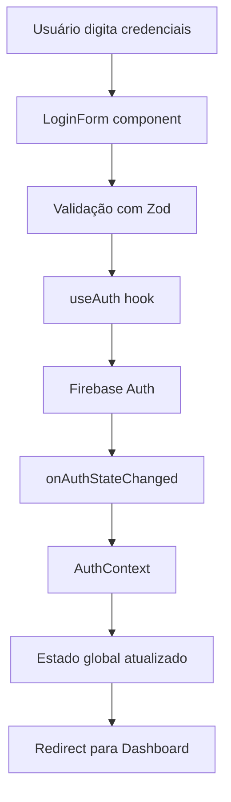
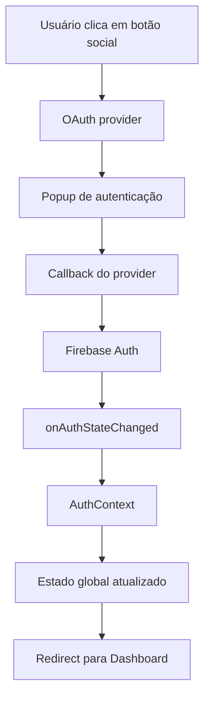
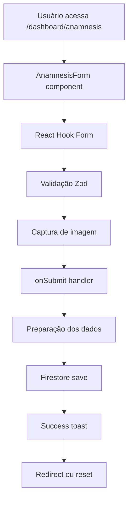
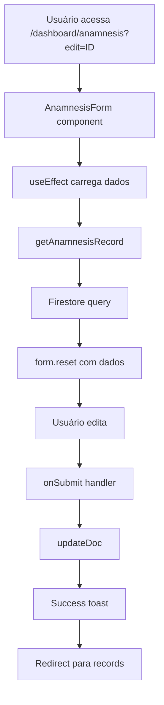
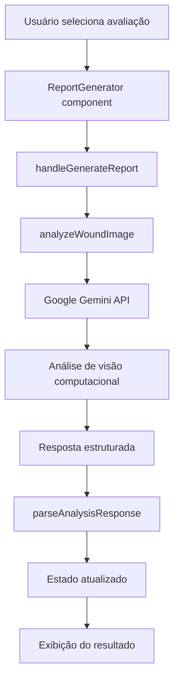
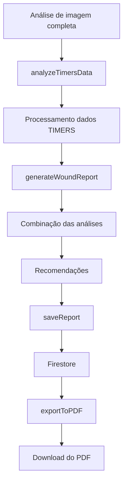
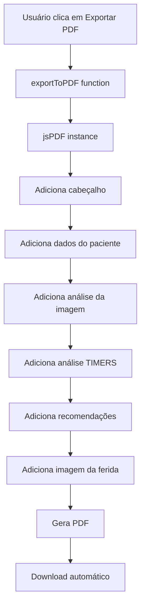
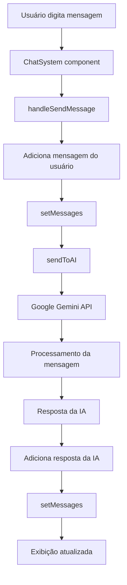

# 🔄 Fluxos de Dados - Heal+

Este guia explica como os dados fluem através do sistema Heal+, desde a entrada do usuário até o armazenamento e processamento.

## 📋 Índice

- [Visão Geral](#visão-geral)
- [Fluxo de Autenticação](#fluxo-de-autenticação)
- [Fluxo de Anamnese](#fluxo-de-anamnese)
- [Fluxo de Análise de IA](#fluxo-de-análise-de-ia)
- [Fluxo de Relatórios](#fluxo-de-relatórios)
- [Fluxo de Chat](#fluxo-de-chat)
- [Integração com Firebase](#integração-com-firebase)
- [Integração com IA](#integração-com-ia)
- [Exemplos Práticos](#exemplos-práticos)

## 🏗️ Visão Geral

### **Arquitetura de Dados**

```
Frontend (Next.js)
├── Componentes React
├── Hooks e Contextos
├── Estado Local/Global
└── Validação (Zod)

Backend (Firebase)
├── Firestore (dados estruturados)
├── Realtime Database (chat)
├── Storage (imagens)
└── Authentication (usuários)

IA (Google Gemini)
├── Análise de imagens
├── Geração de relatórios
└── Chat inteligente
```

### **Padrões de Fluxo**

1. **Entrada do Usuário** → **Validação** → **Processamento** → **Armazenamento**
2. **Carregamento** → **Cache** → **Exibição** → **Atualização**
3. **Evento** → **Estado** → **Efeito** → **UI**

## 🔐 Fluxo de Autenticação

### **1. Login com Email/Senha**



### **2. Login Social (Google/Microsoft/Apple)**



### **3. Implementação**

```typescript
// src/contexts/auth-context.tsx
export function AuthProvider({ children }: { children: React.ReactNode }) {
  const [user, setUser] = useState<User | null>(null);
  const [loading, setLoading] = useState(true);

  useEffect(() => {
    const unsubscribe = onAuthStateChanged(auth, (user) => {
      setUser(user);
      setLoading(false);
    });

    return unsubscribe;
  }, []);

  const login = async (email: string, password: string) => {
    try {
      await signInWithEmailAndPassword(auth, email, password);
    } catch (error) {
      throw error;
    }
  };

  const loginWithGoogle = async () => {
    const provider = new GoogleAuthProvider();
    await signInWithPopup(auth, provider);
  };

  return (
    <AuthContext.Provider value={{ user, loading, login, loginWithGoogle }}>
      {children}
    </AuthContext.Provider>
  );
}
```

## 📝 Fluxo de Anamnese

### **1. Criação de Nova Anamnese**



### **2. Edição de Anamnese Existente**



### **3. Implementação**

```typescript
// src/components/dashboard/anamnesis-form.tsx
export function AnamnesisForm({ recordId, isEditMode }: AnamnesisFormProps) {
  const { user } = useAuth();
  const [woundImageUri, setWoundImageUri] = useState<string>("");
  
  const form = useForm<AnamnesisData>({
    resolver: zodResolver(anamnesisSchema),
    defaultValues: defaultValues,
  });

  // Carregar dados existentes
  useEffect(() => {
    if (isEditMode && recordId) {
      loadExistingRecord(recordId);
    }
  }, [isEditMode, recordId]);

  const loadExistingRecord = async (id: string) => {
    try {
      const record = await getAnamnesisRecord(id);
      form.reset(record);
      setWoundImageUri(record.woundImageUri || "");
    } catch (error) {
      toast({ title: "Erro", description: "Não foi possível carregar o registro" });
    }
  };

  const onSubmit = async (data: AnamnesisData) => {
    try {
      const dataWithImage = { ...data, woundImageUri };
      
      if (isEditMode && recordId) {
        await updateAnamnesisRecord(recordId, dataWithImage);
        toast({ title: "Sucesso", description: "Registro atualizado" });
        router.push("/dashboard/anamnesis-records");
      } else {
        await createAnamnesisRecord(dataWithImage);
        toast({ title: "Sucesso", description: "Registro criado" });
        form.reset();
        setWoundImageUri("");
      }
    } catch (error) {
      toast({ title: "Erro", description: "Não foi possível salvar" });
    }
  };

  return (
    <Form {...form}>
      <form onSubmit={form.handleSubmit(onSubmit)}>
        {/* Campos do formulário */}
      </form>
    </Form>
  );
}
```

## 🤖 Fluxo de Análise de IA

### **1. Análise de Imagem**



### **2. Geração de Relatório**



### **3. Implementação**

```typescript
// src/components/dashboard/report-generator.tsx
export function ReportGenerator() {
  const [selectedRecord, setSelectedRecord] = useState<AnamnesisRecord | null>(null);
  const [isGenerating, setIsGenerating] = useState(false);
  const [generatedReport, setGeneratedReport] = useState<WoundReport | null>(null);

  const handleGenerateReport = async () => {
    if (!selectedRecord) return;
    
    setIsGenerating(true);
    
    try {
      // 1. Análise da imagem
      const imageAnalysis = await analyzeWoundImage(selectedRecord.woundImageUri);
      
      // 2. Análise dos dados TIMERS
      const timersAnalysis = await analyzeTimersData(selectedRecord);
      
      // 3. Geração do relatório
      const report = await generateWoundReport({
        imageAnalysis,
        timersAnalysis,
        patientData: selectedRecord,
      });
      
      // 4. Salvar no banco
      await saveReport(user!.uid, report);
      
      setGeneratedReport(report);
      
    } catch (error) {
      toast({ title: "Erro", description: "Não foi possível gerar o relatório" });
    } finally {
      setIsGenerating(false);
    }
  };

  return (
    <div className="space-y-6">
      {/* Seletor de avaliação */}
      <Select value={selectedAnamnesisId} onValueChange={setSelectedAnamnesisId}>
        {/* Opções */}
      </Select>
      
      {/* Botão de geração */}
      <Button onClick={handleGenerateReport} disabled={!selectedRecord || isGenerating}>
        {isGenerating ? "Gerando..." : "Gerar Relatório"}
      </Button>
      
      {/* Resultado */}
      {generatedReport && (
        <div className="prose max-w-none">
          <h3>Análise da Imagem</h3>
          <p>{generatedReport.imageAnalysis}</p>
          
          <h3>Análise TIMERS</h3>
          <p>{generatedReport.timersAnalysis}</p>
          
          <h3>Recomendações</h3>
          <p>{generatedReport.recommendations}</p>
        </div>
      )}
    </div>
  );
}
```

## 📄 Fluxo de Relatórios

### **1. Geração de PDF**



### **2. Implementação**

```typescript
// src/lib/pdf-generator.ts
import jsPDF from 'jspdf';
import 'jspdf-autotable';

export async function exportReportToPDF(report: WoundReport): Promise<void> {
  const doc = new jsPDF();
  
  // Cabeçalho
  doc.setFontSize(20);
  doc.text('Relatório de Análise de Ferida', 20, 20);
  
  // Dados do paciente
  doc.setFontSize(12);
  doc.text(`Paciente: ${report.patientData.patientName}`, 20, 40);
  doc.text(`Data: ${formatDate(report.timestamp)}`, 20, 50);
  
  // Análise da imagem
  doc.setFontSize(14);
  doc.text('Análise da Imagem', 20, 70);
  doc.setFontSize(10);
  doc.text(report.imageAnalysis, 20, 80, { maxWidth: 170 });
  
  // Análise TIMERS
  doc.setFontSize(14);
  doc.text('Análise TIMERS', 20, 120);
  doc.setFontSize(10);
  doc.text(report.timersAnalysis, 20, 130, { maxWidth: 170 });
  
  // Recomendações
  doc.setFontSize(14);
  doc.text('Recomendações', 20, 170);
  doc.setFontSize(10);
  doc.text(report.recommendations, 20, 180, { maxWidth: 170 });
  
  // Imagem da ferida
  if (report.patientData.woundImageUri) {
    const img = new Image();
    img.onload = () => {
      doc.addImage(img, 'JPEG', 20, 220, 100, 75);
      doc.save(`relatorio-${report.patientData.patientName}-${formatDate(report.timestamp)}.pdf`);
    };
    img.src = report.patientData.woundImageUri;
  } else {
    doc.save(`relatorio-${report.patientData.patientName}-${formatDate(report.timestamp)}.pdf`);
  }
}
```

## 💬 Fluxo de Chat

### **1. Envio de Mensagem**



### **2. Implementação**

```typescript
// src/components/dashboard/chat-system.tsx
export function ChatSystem() {
  const [messages, setMessages] = useState<ChatMessage[]>([]);
  const [inputMessage, setInputMessage] = useState("");
  const [isLoading, setIsLoading] = useState(false);

  const handleSendMessage = async () => {
    if (!inputMessage.trim()) return;
    
    setIsLoading(true);
    
    try {
      // 1. Adicionar mensagem do usuário
      const userMessage: ChatMessage = {
        id: generateId(),
        text: inputMessage,
        sender: "user",
        timestamp: new Date(),
      };
      
      setMessages(prev => [...prev, userMessage]);
      
      // 2. Enviar para IA
      const aiResponse = await sendToAI(inputMessage);
      
      // 3. Adicionar resposta da IA
      const aiMessage: ChatMessage = {
        id: generateId(),
        text: aiResponse,
        sender: "ai",
        timestamp: new Date(),
      };
      
      setMessages(prev => [...prev, aiMessage]);
      
    } catch (error) {
      console.error("Erro no chat:", error);
    } finally {
      setIsLoading(false);
    }
  };

  return (
    <div className="flex flex-col h-full">
      {/* Lista de mensagens */}
      <div className="flex-1 overflow-y-auto">
        {messages.map(message => (
          <ChatMessage key={message.id} message={message} />
        ))}
      </div>
      
      {/* Input de mensagem */}
      <div className="border-t p-4">
        <div className="flex gap-2">
          <Input
            value={inputMessage}
            onChange={(e) => setInputMessage(e.target.value)}
            placeholder="Digite sua mensagem..."
          />
          <Button onClick={handleSendMessage} disabled={isLoading}>
            Enviar
          </Button>
        </div>
      </div>
    </div>
  );
}
```

## 🔥 Integração com Firebase

### **1. Estrutura de Dados no Firestore**

```typescript
// Estrutura de coleções
users/
├── {userId}/
│   ├── anamnesis/
│   │   ├── {anamnesisId}/
│   │   │   ├── patientName: string
│   │   │   ├── woundLocation: string
│   │   │   ├── tissueType: string
│   │   │   ├── measurements: object
│   │   │   ├── woundImageUri: string
│   │   │   ├── createdAt: timestamp
│   │   │   └── updatedAt: timestamp
│   │   └── ...
│   ├── reports/
│   │   ├── {reportId}/
│   │   │   ├── anamnesisId: string
│   │   │   ├── imageAnalysis: string
│   │   │   ├── timersAnalysis: string
│   │   │   ├── recommendations: string
│   │   │   ├── confidence: number
│   │   │   └── createdAt: timestamp
│   │   └── ...
│   └── profile/
│       ├── name: string
│       ├── email: string
│       ├── role: string
│       └── ...
```

### **2. Operações CRUD**

```typescript
// src/lib/firestore-operations.ts
export class FirestoreService {
  // Criar
  static async create(collectionPath: string, data: any) {
    const docRef = await addDoc(collection(db, collectionPath), {
      ...data,
      createdAt: serverTimestamp(),
      updatedAt: serverTimestamp(),
    });
    return docRef.id;
  }

  // Ler
  static async get(collectionPath: string, filters?: any[]) {
    let q = collection(db, collectionPath);
    
    if (filters) {
      filters.forEach(filter => {
        q = query(q, where(filter.field, filter.operator, filter.value));
      });
    }
    
    const querySnapshot = await getDocs(q);
    return querySnapshot.docs.map(doc => ({
      id: doc.id,
      ...doc.data(),
    }));
  }

  // Atualizar
  static async update(collectionPath: string, docId: string, data: any) {
    const docRef = doc(db, collectionPath, docId);
    await updateDoc(docRef, {
      ...data,
      updatedAt: serverTimestamp(),
    });
  }

  // Deletar
  static async delete(collectionPath: string, docId: string) {
    const docRef = doc(db, collectionPath, docId);
    await deleteDoc(docRef);
  }
}
```

### **3. Regras de Segurança**

```javascript
// firestore.rules
rules_version = '2';

service cloud.firestore {
  match /databases/{database}/documents {
    // Usuários podem ler/escrever seus próprios documentos
    match /users/{userId} {
      allow read, write: if request.auth != null && request.auth.uid == userId;
      allow list: if request.auth != null;
    }

    // Subcoleções dentro de users
    match /users/{userId}/{collection}/{docId} {
      allow read, write: if request.auth != null && request.auth.uid == userId;
      allow list: if request.auth != null;
    }
  }
}
```

## 🤖 Integração com IA

### **1. Configuração do Gemini**

```typescript
// src/ai/genkit.ts
import { GoogleGenerativeAI } from '@google/generative-ai';

const genAI = new GoogleGenerativeAI(process.env.GEMINI_API_KEY!);

export async function analyzeWoundImage(imageData: string): Promise<WoundAnalysis> {
  const model = genAI.getGenerativeModel({ model: 'gemini-pro-vision' });
  
  const prompt = `
    Analise esta imagem de ferida e forneça:
    1. Tipo de tecido predominante
    2. Sinais de infecção
    3. Nível de cicatrização
    4. Recomendações de tratamento
  `;

  const result = await model.generateContent([prompt, imageData]);
  const response = await result.response;
  const text = response.text();
  
  return parseAnalysisResponse(text);
}
```

### **2. Fluxo de Análise**

```typescript
// src/ai/flows/analyze-wound.ts
export async function analyzeWoundFlow(imageData: string, anamnesisData: AnamnesisData) {
  try {
    // 1. Análise da imagem
    const imageAnalysis = await analyzeWoundImage(imageData);
    
    // 2. Análise dos dados TIMERS
    const timersAnalysis = await analyzeTimersData(anamnesisData);
    
    // 3. Geração de relatório
    const report = await generateReport(imageAnalysis, timersAnalysis);
    
    // 4. Recomendações
    const recommendations = await generateRecommendations(report);
    
    return {
      imageAnalysis,
      timersAnalysis,
      report,
      recommendations,
    };
  } catch (error) {
    console.error("Erro no fluxo de análise:", error);
    throw error;
  }
}
```

## 💡 Exemplos Práticos

### **1. Hook Personalizado para Dados**

```typescript
// src/hooks/use-anamnesis.ts
export function useAnamnesis(userId?: string) {
  const [anamneses, setAnamneses] = useState<AnamnesisRecord[]>([]);
  const [loading, setLoading] = useState(false);
  const [error, setError] = useState<string | null>(null);

  const fetchAnamneses = async () => {
    if (!userId) return;
    
    setLoading(true);
    setError(null);
    
    try {
      const data = await getAnamneses(userId);
      setAnamneses(data);
    } catch (err) {
      setError(err instanceof Error ? err.message : 'Erro desconhecido');
    } finally {
      setLoading(false);
    }
  };

  const createAnamnesis = async (data: any) => {
    if (!userId) return;
    
    try {
      const id = await saveAnamnesis(userId, data);
      await fetchAnamneses(); // Recarregar lista
      return id;
    } catch (err) {
      setError(err instanceof Error ? err.message : 'Erro ao salvar');
      throw err;
    }
  };

  useEffect(() => {
    fetchAnamneses();
  }, [userId]);

  return {
    anamneses,
    loading,
    error,
    createAnamnesis,
    refetch: fetchAnamneses,
  };
}
```

### **2. Context para Estado Global**

```typescript
// src/contexts/app-context.tsx
interface AppContextType {
  theme: 'light' | 'dark';
  setTheme: (theme: 'light' | 'dark') => void;
  user: User | null;
  setUser: (user: User | null) => void;
  notifications: Notification[];
  addNotification: (notification: Notification) => void;
  removeNotification: (id: string) => void;
}

export const AppContext = createContext<AppContextType | undefined>(undefined);

export function AppProvider({ children }: { children: React.ReactNode }) {
  const [theme, setTheme] = useState<'light' | 'dark'>('light');
  const [user, setUser] = useState<User | null>(null);
  const [notifications, setNotifications] = useState<Notification[]>([]);

  const addNotification = (notification: Notification) => {
    setNotifications(prev => [...prev, notification]);
  };

  const removeNotification = (id: string) => {
    setNotifications(prev => prev.filter(n => n.id !== id));
  };

  return (
    <AppContext.Provider value={{
      theme,
      setTheme,
      user,
      setUser,
      notifications,
      addNotification,
      removeNotification,
    }}>
      {children}
    </AppContext.Provider>
  );
}
```

### **3. Validação de Dados**

```typescript
// src/lib/validation.ts
import { z } from 'zod';

export const anamnesisSchema = z.object({
  patientName: z.string().min(2, 'Nome deve ter pelo menos 2 caracteres'),
  patientAge: z.number().min(0).max(120),
  woundLocation: z.string().min(1, 'Localização é obrigatória'),
  tissueType: z.enum(['granulation', 'slough', 'necrosis', 'epithelization']),
  measurements: z.object({
    length: z.number().min(0),
    width: z.number().min(0),
    depth: z.number().min(0),
  }),
  woundImageUri: z.string().optional(),
});

export type AnamnesisData = z.infer<typeof anamnesisSchema>;

// Validação em tempo real
export function validateAnamnesisData(data: any): AnamnesisData {
  try {
    return anamnesisSchema.parse(data);
  } catch (error) {
    if (error instanceof z.ZodError) {
      throw new Error(`Dados inválidos: ${error.errors.map(e => e.message).join(', ')}`);
    }
    throw error;
  }
}
```

## 🎯 Dicas para Estudo

### **1. Entenda os Fluxos**
- **Autenticação**: Como o usuário faz login
- **Formulários**: Como os dados são validados e salvos
- **IA**: Como as análises são processadas
- **Chat**: Como as mensagens fluem

### **2. Analise as Integrações**
- **Firebase**: Como os dados são armazenados
- **Gemini**: Como a IA é chamada
- **PDF**: Como os relatórios são gerados

### **3. Pratique**
- **Crie hooks**: Experimente criar hooks personalizados
- **Modifique fluxos**: Adicione novas funcionalidades
- **Debug**: Resolva problemas de fluxo

### **4. Use as Ferramentas**
- **DevTools**: Monitore o estado
- **Network**: Veja as requisições
- **Console**: Acompanhe os logs

---

**🔄 Este guia te ajudará a entender profundamente como os dados fluem através do sistema Heal+!**
